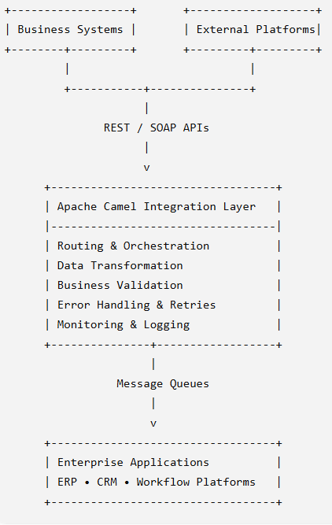

# Enterprise Integration Platform using Apache Camel

## Overview

Designed and implemented a scalable enterprise integration platform to enable secure, reliable, and automated data exchange between multiple business applications and enterprise systems.

The solution leveraged Apache Camel and Enterprise Integration Patterns (EIP) to orchestrate complex business workflows, perform data transformations, manage asynchronous communication, and provide centralized monitoring and error handling capabilities.

The platform was designed as a reusable integration foundation, allowing future business applications and integrations to be onboarded with minimal development effort.

---

## Business Challenge

Organizations often operate multiple business applications that need to exchange information seamlessly.

The key challenges included:

- Integrating heterogeneous systems using standardized interfaces.
- Eliminating manual data transfers and reconciliation activities.
- Supporting both real-time and asynchronous business processes.
- Managing complex data transformations and validations.
- Ensuring reliability through monitoring, retries, and exception handling.
- Building a scalable foundation for future integration requirements.

---

## Solution Architecture

> **Note:**  
> The architecture below has been intentionally generalized to comply with client confidentiality and NDA obligations.

### High-Level Components

- Business Applications
- External Platforms
- REST APIs
- SOAP Services
- Apache Camel Integration Layer
- Message Queues
- Data Transformation Services
- Monitoring & Logging Platform
- Enterprise Systems (ERP, CRM, Workflow Platforms)

---

## Enterprise Integration Patterns (EIP)

The solution utilized proven Enterprise Integration Patterns to ensure scalability, maintainability, and reliability.

| Pattern | Purpose |
|----------|----------|
| Message Translator | Transform data between different formats |
| Content-Based Router | Route messages using business rules |
| Request-Reply | Handle synchronous integrations |
| Publish-Subscribe | Enable event-driven communication |
| Dead Letter Channel | Manage failed messages |
| Retry Pattern | Recover from transient failures |
| Idempotent Consumer | Prevent duplicate processing |
| Event-Driven Processing | Support asynchronous workflows |

---

## Technology Stack

| Category | Technologies |
|-----------|--------------|
| Language | Java |
| Framework | Spring Boot |
| Integration | Apache Camel |
| APIs | REST, SOAP |
| Messaging | Enterprise Message Queues |
| Database | Oracle Database, PostgreSQL |
| Cloud | AWS, Azure |
| Containerization | Docker |
| Monitoring | Centralized Logging & Alerting |

---

## Key Responsibilities

### Integration Architecture

- Designed end-to-end enterprise integration architecture.
- Defined reusable integration standards and patterns.
- Built scalable and loosely coupled integration services.
- Established operational and monitoring strategies.

### API Development

- Developed secure REST and SOAP integrations.
- Implemented authentication and validation mechanisms.
- Supported synchronous and asynchronous communication models.
- Designed reusable API contracts for enterprise systems.

### Data Transformation

- Implemented data mapping and transformation services.
- Applied business validation and enrichment rules.
- Managed interoperability between heterogeneous applications.
- Ensured data consistency across systems.

### Reliability & Monitoring

- Implemented retry and exception-handling mechanisms.
- Designed dead-letter processing workflows.
- Enabled centralized logging and operational visibility.
- Improved supportability through monitoring and alerts.

---

## Business Benefits

### Operational Efficiency

- Reduced manual processing through workflow automation.
- Improved transaction processing speed.
- Minimized reconciliation activities.

### Scalability

- Enabled rapid onboarding of future integrations.
- Supported growing transaction volumes.
- Established reusable enterprise integration components.

### Reliability

- Improved resilience through automated recovery mechanisms.
- Reduced operational incidents through proactive monitoring.
- Enhanced business continuity.

### Data Quality

- Increased consistency across business applications.
- Eliminated duplicate processing.
- Standardized enterprise data exchange.

---

## Business Impact

- Automated complex enterprise workflows.
- Improved interoperability between business systems.
- Reduced operational overhead.
- Increased reliability through proven integration patterns.
- Built a scalable foundation for future digital initiatives.
- Enhanced visibility through centralized monitoring and logging.

---

## Skills Demonstrated

- Enterprise Integration Architecture
- Apache Camel Development
- Spring Boot Microservices
- Enterprise Integration Patterns (EIP)
- REST & SOAP APIs
- Message-Driven Architecture
- Cloud-Native Integration Solutions
- Docker & Containerization
- Monitoring & Operational Support

---

## Disclaimer

This case study is based on real-world enterprise experience.

To respect client confidentiality and NDA obligations, all business details, implementation specifics, architecture diagrams, source code, and identifying information have been generalized or recreated for demonstration purposes.

The content is intended solely to showcase technical capabilities, solution approaches, and enterprise integration expertise.

No proprietary code, client data, or confidential information is included in this repository.

---

⭐ If you found these case studies useful, feel free to connect with me on LinkedIn.