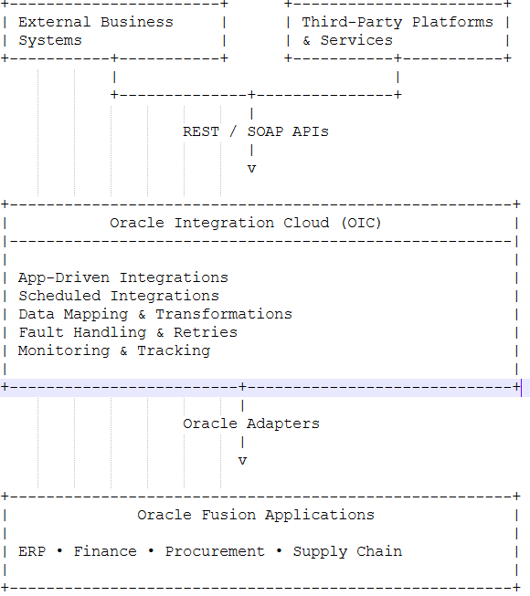

# Enterprise Integration using Oracle Integration Cloud (OIC)

A generalized enterprise integration case study demonstrating scalable, secure, and cloud-native integrations using Oracle Integration Cloud (OIC), Oracle Fusion Applications, REST APIs, and enterprise integration best practices.

---

## Overview

Designed and implemented enterprise integrations using Oracle Integration Cloud (OIC) to enable secure, reliable, and automated data exchange between external business systems and Oracle Fusion Applications.

The solution leveraged Oracle's cloud-native integration capabilities to orchestrate business processes, perform data transformations, manage exceptions, and provide centralized monitoring and operational visibility.

The platform was designed as a reusable integration foundation, enabling future business applications and services to be onboarded with minimal development effort.

---

## Business Challenge

Enterprise organizations often operate multiple business applications that must seamlessly exchange information with Oracle Fusion Applications.

The key challenges included:

- Integrating heterogeneous systems with Oracle Fusion ERP.
- Eliminating manual data transfers and reconciliation activities.
- Supporting both real-time and scheduled business processes.
- Managing complex data transformations and validations.
- Ensuring reliability through monitoring, retries, and fault handling.
- Building a scalable cloud-native integration foundation.

---

## Solution Architecture

> **Note:**  
> The architecture below has been intentionally generalized to comply with client confidentiality and NDA obligations.

### High-Level Components

- External Business Systems
- REST APIs
- SOAP Services
- Oracle Integration Cloud (OIC)
- Integration Flows & Orchestration
- Data Mapping & Transformations
- Monitoring & Tracking Dashboard
- Oracle Fusion Applications

---

## Integration Patterns

The solution leveraged standard enterprise integration patterns supported by Oracle Integration Cloud.

| Pattern | Purpose |
|----------|----------|
| App-Driven Orchestration | Event-driven business processing |
| Scheduled Integrations | Batch and periodic synchronization |
| Request-Reply | Synchronous integrations |
| Publish-Subscribe | Event-based communication |
| Data Transformation | Mapping between heterogeneous systems |
| Exception Handling | Fault recovery and monitoring |
| Retry Mechanisms | Handling transient failures |

---

## Technology Stack

| Category | Technologies |
|-----------|--------------|
| Integration Platform | Oracle Integration Cloud (OIC) |
| ERP Platform | Oracle Fusion Applications |
| APIs | REST, SOAP |
| Data Formats | JSON, XML |
| Security | OAuth 2.0, Basic Authentication |
| Cloud Platform | Oracle Cloud Infrastructure (OCI) |
| Monitoring | OIC Tracking & Monitoring |

---

## Key Responsibilities

### Integration Architecture

- Designed end-to-end Oracle integration architecture.
- Established reusable integration standards and best practices.
- Defined secure communication mechanisms between systems.
- Planned operational monitoring and support processes.

### OIC Development

- Developed App-Driven and Scheduled integrations.
- Configured Oracle ERP Cloud adapters.
- Implemented REST and SOAP integrations.
- Built reusable orchestration workflows.

### Data Transformation

- Implemented business validations and transformation logic.
- Designed mappings between external and Oracle Fusion data models.
- Ensured data quality and consistency across systems.
- Applied enterprise integration best practices.

### Reliability & Monitoring

- Configured fault handling and retry mechanisms.
- Enabled centralized operational visibility.
- Implemented integration monitoring and tracking.
- Improved supportability through proactive alerting.

---

## Business Benefits

### Operational Efficiency

- Reduced manual intervention through process automation.
- Improved transaction processing speed.
- Streamlined enterprise workflows.

### Scalability

- Enabled rapid onboarding of future Oracle integrations.
- Supported growing business volumes.
- Established reusable cloud-native integration components.

### Reliability

- Improved resilience through managed cloud services.
- Reduced operational incidents through centralized monitoring.
- Enhanced business continuity through fault handling.

### Data Quality

- Increased consistency across enterprise applications.
- Reduced reconciliation efforts.
- Standardized data exchange processes.

---

## Business Impact

- Automated critical enterprise workflows.
- Improved interoperability between external systems and Oracle Fusion.
- Reduced operational overhead.
- Increased reliability through cloud-native integration capabilities.
- Built a scalable foundation for future digital initiatives.
- Enhanced visibility through centralized monitoring and tracking.

---

## Skills Demonstrated

- Oracle Integration Cloud (OIC)
- Oracle Fusion Integration
- Enterprise Integration Architecture
- REST & SOAP APIs
- Data Mapping & Transformation
- Cloud-Native Integration Solutions
- OAuth & Enterprise Security
- Monitoring & Operational Support

---

## Disclaimer

This case study is based on real-world enterprise experience.

To respect client confidentiality and NDA obligations, all business details, implementation specifics, architecture diagrams, source code, and identifying information have been intentionally generalized or recreated for demonstration purposes.

The content is intended solely to showcase technical capabilities, solution approaches, and enterprise integration expertise.

No proprietary code, client data, or confidential information is included in this repository.

---

## Connect with Me

💼 LinkedIn: [Babu Lal](https://www.linkedin.com/in/babu-lal-91712873/)

🏢 Company: [Paplaj Software Services](https://www.linkedin.com/company/paplaj-software-services/)

💻 GitHub: [paplaj-software](https://github.com/paplaj-software)

---

⭐ Feel free to connect if you're interested in Enterprise Integration, ETRM/CTRM Solutions, APIs, Workflow Automation, AI, and Cloud-Native Architectures.
